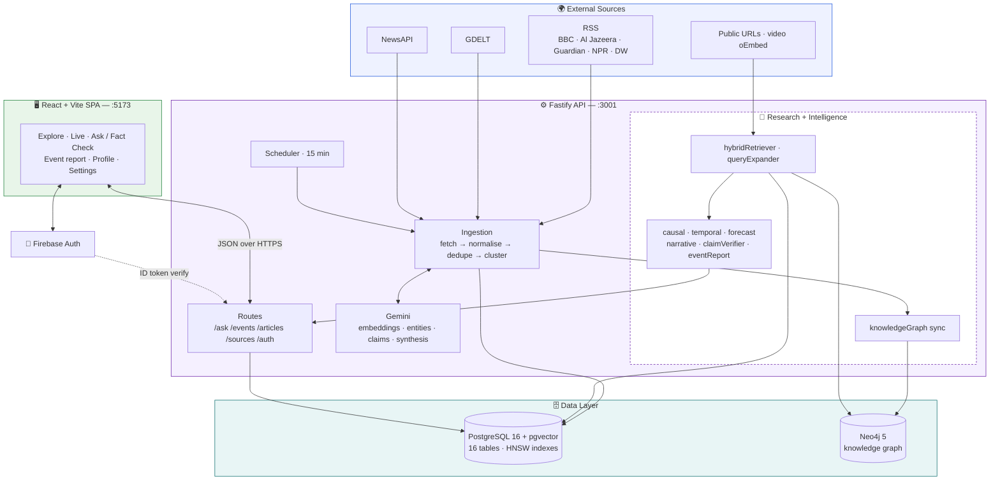
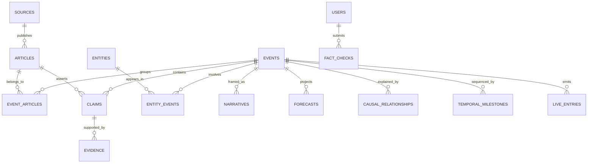

<div align="center">

# ॥ PRAMĀṆA ॥

### **Global news intelligence — verified, contextualised, and traced back to the source.**

*Pramāṇa (प्रमाण) — Sanskrit: "a valid means of knowledge."*

<br>

[](https://nodejs.org)
[](https://react.dev)
[](https://vitejs.dev)
[](https://fastify.dev)

[](https://github.com/pgvector/pgvector)
[](https://neo4j.com)
[](https://ai.google.dev)
[](https://firebase.google.com)


<br>

**[Overview](#-the-problem) · [Features](#-features) · [Research brain](#-the-research-brain) · [Architecture](#%EF%B8%8F-architecture) · [Quick Start](#-quick-start) · [API](#-api-reference) · [Deploy](#-deployment) · [Roadmap](#%EF%B8%8F-roadmap)**

</div>

---

## 🧭 The problem

Most people now get their news from a feed — and a feed is optimised for engagement, not accuracy. Two people can read about the same protest and walk away with opposite versions of reality, because the algorithm served each of them the framing they already agreed with.

**PRAMĀṆA takes the opposite approach.** It ingests the same story from many outlets at once, breaks it down into individual **claims**, and shows you what is actually verified, what is still uncertain, what outlets contradict each other on — and *who framed it which way*.

> Not "here are 10 links." Instead: **here is the event, here is what holds up, and here is where reporting diverges.**

---

## ✨ Features

| | Capability | What it does | Status |
|:--:|---|---|:--:|
| 📡 | **Multi-source ingestion** | RSS + GDELT + NewsAPI fetched on a rolling schedule | ✅ |
| 🧹 | **Normalise & dedupe** | HTML stripping, tracking-param cleanup, content-hash dedupe | ✅ |
| 🧲 | **Event clustering** | Related articles from different outlets collapse into one event | ✅ |
| 🧠 | **Claim & entity extraction** | Gemini pulls atomic claims and named entities out of article text | ✅ |
| 🕸️ | **Knowledge graph sync** | Postgres → Neo4j after every ingest; graph context on every query | ✅ |
| 🔎 | **Ask — 9-vector hybrid retrieval** | Conversational research over the archive, with sources attached | ✅ |
| ✅ | **Fact Check mode** | Claim-by-claim verdicts with syndication-aware independence checks | ✅ |
| 🧭 | **Explore** | Category filters, search, live rail — now the app's home surface | ✅ |
| 📰 | **Long-form event reports** | Auto-assembled dossier: articles, claims, entities, framing, related events | ✅ |
| ⛓️ | **Causal chain engine** | Eight-stage cause→effect chains, each edge marked supported or inferred | ✅ |
| 🕰️ | **Temporal engine** | Before / trigger / during / aftermath / subsequent milestone sequencing | ✅ |
| 📈 | **Calibrated forecasting** | Logistic-regression escalation model with Wilson confidence intervals | ✅ |
| 🎭 | **Narrative analysis** | Deterministic cross-source framing and terminology comparison | ✅ |
| 🔗 | **URL & video reader** | SSRF-guarded page fetch, oEmbed video metadata | ✅ |
| 🔴 | **Live wire** | Rolling feed of newly detected events and updates | ✅ |
| 🔐 | **Auth + profile** | Firebase Google sign-in, settings, account deletion, guest mode | ✅ |
| 🖼️ | **Image & media verification** | Provenance and reverse lookup for submitted images | 🚧 |

<sub>Verdicts are never binary. Every claim resolves to **verified** · **unverified** · **contradicted by [source]** — a claim is never labelled "false" without an attributed contradiction.</sub>

---

## 🔬 The research brain

`POST /api/ask/query` runs a fixed eight-stage pipeline. The deliberate design choice: **the model writes prose, nothing else.** Every number, verdict and causal edge is computed before synthesis — and if Gemini is unavailable or times out, stage 8 assembles the same answer deterministically.

```mermaid
flowchart LR
    Q["🗣️ Query · claim · URL"] --> E["1 · Query expansion<br/><i>entities · hypotheses · keywords</i>"]
    E --> R["2 · 9-vector hybrid retrieval<br/><i>lexical · semantic · graph · primary source<br/>historical · claims · policy · science · signals</i>"]
    R --> P["3 · Hypothesis pruning<br/><i>zero corroboration → discarded</i>"]
    P --> C["4 · Causal + temporal chain"]
    C --> N["5 · Narrative framing analysis"]
    N --> F["6 · Calibrated ML forecast"]
    F --> V["7 · Claim verification<br/><i>+ syndication independence</i>"]
    V --> S["8 · Grounded synthesis<br/><i>deterministic fallback if LLM down</i>"]
    S --> A["📄 Sourced dossier"]

    style Q fill:#eef2ff,stroke:#1a56db
    style R fill:#f5f0ff,stroke:#6b21a8
    style F fill:#f5f0ff,stroke:#6b21a8
    style V fill:#e8f5e9,stroke:#1a7d37
    style A fill:#e8f5f5,stroke:#0e6e6e
```



<details>
<summary><b>🏛️ Source hierarchy — not all corroboration is equal</b></summary>

<br>

Every source is classified before it is allowed to count as evidence:

| Tier | Matches | Weight |
|---|---|---|
| `PRIMARY SOURCE` | `.gov` · `.mil` · `.int` · ministries · press releases · treaties | Highest |
| `SCIENTIFIC_TECHNICAL` | `.edu` · journals · USGS · NASA · Copernicus · met offices | High |
| `INDEPENDENT_NEWS` | Reuters · AP · BBC · Al Jazeera · Guardian · DW · NPR | Standard |
| `SECONDARY_REPORT` | Aggregators and downstream reprints | Low |
| `PUBLIC_SIGNAL` | Social platforms, forums, unattributed posts | Signal only |

**Syndication is caught, not counted.** Twelve outlets running the same wire copy is *one* independent source, not twelve. `claimVerifier` detects wire origin and computes Jaccard text overlap, collapsing reprints into a single independent-source credit before any verdict is issued.

</details>

<details>
<summary><b>📈 Forecasting — <code>pramana-calibrated-logreg-v1.2</code></b></summary>

<br>

**Target:** probability of escalation to critical severity within 72 hours.

The LLM never produces a probability. A logistic regression does, over six features — article velocity, source breadth, source reliability, contradiction penalty, category hazard rate and entity salience — with per-feature contributions exposed so any number can be traced back to its inputs. Output carries 95% Wilson confidence intervals.

When the evidence base is too thin, the engine returns **`NO_FORECAST_JUSTIFIED`** instead of a low-confidence guess. A refused forecast is a feature.

</details>

<details>
<summary><b>⛓️ Causal chains — supported vs inferred</b></summary>

<br>

Eight relationship types: `precondition` · `trigger` · `mechanism` · `chain_reaction` · `amplifier` · `immediate_consequence` · `secondary_effect` · `human_response`.

Each edge stores `is_directly_supported`, a confidence score, and `evidence_refs` pointing at the articles that justify it. Where a stage of the chain has no evidence, the report states that the evidence is missing rather than bridging the gap with plausible-sounding text.

</details>

---

## 🏗️ Architecture

A React SPA talks to a Fastify API, which owns two databases: **PostgreSQL** for records and vectors, **Neo4j** for relationships.



<details>
<summary><b>🔄 How one article becomes intelligence</b></summary>

<br>


**Fail-open by design:** without `GEMINI_API_KEY` the pipeline still fetches, normalises, dedupes and clusters — it skips enrichment rather than collapsing. Calls are spaced 250 ms apart to stay inside free-tier quota.

</details>

---

## 🗃️ Data model

**PostgreSQL** — 16 tables across three migrations, `pgvector` HNSW indexes on `articles.embedding` and `events.embedding`, `pg_trgm` GIN indexes for fuzzy title search.



| Migration | Adds |
|---|---|
| `001_core_schema` | 14 core tables, pgvector + pg_trgm extensions, HNSW indexes |
| `002_user_profile_settings` | JSONB `users.settings` + GIN index |
| `003_causal_temporal_intelligence` | `causal_relationships`, `temporal_milestones`, article `wire_service` + `syndication_cluster_id` |

<details>
<summary><b>🕸️ Neo4j graph schema</b></summary>

<br>

Eleven uniqueness constraints and nine text indexes, created idempotently on migrate:

`Person` · `Organization` · `Country` · `Location` · `Event` · `Article` · `Claim` · `Source` · `Topic` · `Narrative` · `Policy`

`knowledgeGraph.js` mirrors Postgres into the graph after each ingest batch and serves `queryGraphContext()` — related entities, causal links and neighbouring events — as one of the nine retrieval vectors.

</details>

---

## 🧰 Tech stack

| Layer | Choice | Why |
|---|---|---|
| **Frontend** | React 18 · Vite 6 · React Router 6 · Zustand | Fast HMR, tiny state layer, no framework lock-in |
| **Styling** | Hand-written CSS design system (~2,700 lines) | Editorial look, light mode only, zero UI-kit weight |
| **Backend** | Node ≥20 · Fastify 5 | Schema-first, fast, first-party helmet/cors/rate-limit |
| **Relational** | PostgreSQL 16 + pgvector + pg_trgm | Records, vectors and fuzzy search in one engine |
| **Graph** | Neo4j 5 Community (+ APOC) | Entity, causal and narrative relationships |
| **AI** | Gemini flash-lite · `gemini-embedding-001` @ 768-dim | Free-tier friendly; prose only, never arithmetic |
| **Auth** | Firebase Auth (Google) + `firebase-admin` | Token verification server-side, no password storage |
| **Jobs** | Interval scheduler + DB job table + `pg-boss` | Locked runs, retry tracking, no extra infrastructure |
| **Tests** | Vitest — 74 tests, 14 suites | Real HTTP calls against a built app instance |
| **Infra** | Docker Compose · npm workspaces · Render + Vercel | One command locally, two services in production |

---

## 🚀 Quick start

### Prerequisites

`Node.js ≥ 20` · `Docker + Docker Compose` · `Git`

### 1 — Clone and install

```bash
git clone https://github.com/xeevees-lab/pramana.git
cd pramana
npm install
```

### 2 — Configure environment

```bash
cp .env.example .env
```

Then open `.env` and fill in the values below.

### 3 — Start the databases

```bash
docker compose up -d && docker compose ps
```

Brings up PostgreSQL 16 + pgvector on **`5433`** (deliberately off 5432 to avoid clashing with a local Postgres) and Neo4j 5 on **`7474`** (browser) / **`7687`** (Bolt).

### 4 — Migrate and seed

```bash
npm run db:migrate
```

Applies all three migrations, pgvector HNSW indexes, Neo4j constraints, and seeds seven default global sources.

### 5 — Run it

```bash
npm run dev
```

| URL | What |
|---|---|
| http://localhost:5173 | The app — lands on **Explore** |
| http://localhost:5173/ask | Ask · switch to Fact Check inside the workspace |
| http://localhost:3001/api/health | Liveness |
| http://localhost:3001/api/health/ready | Readiness — per-dependency status |

No Firebase keys yet? Click **“Explore Intelligence Platform (Guest Access) →”** on the login screen and browse everything read-only.

---

## 🔑 Environment variables

| Variable | Required | Where to get it |
|---|:--:|---|
| `DATABASE_URL` / `PG*` | ⚙️ default | Pre-filled to match `docker-compose.yml` |
| `NEO4J_URI` / `NEO4J_USER` / `NEO4J_PASSWORD` | ⚙️ default | Pre-filled to match `docker-compose.yml` |
| `FIREBASE_PROJECT_ID` | ✅ | Firebase Console → Project Settings |
| `FIREBASE_CLIENT_EMAIL` · `FIREBASE_PRIVATE_KEY` | ✅ | Firebase Console → Service Accounts → Generate key |
| `VITE_FIREBASE_*` | ✅ | Firebase Console → Project Settings → Web app config |
| `GEMINI_API_KEY` | ✅ | [Google AI Studio](https://aistudio.google.com/apikey) |
| `GEMINI_MODEL` | ➖ | Overrides the generation model — defaults to `gemini-3.5-flash-lite` |
| `GEMINI_EMBEDDING_MODEL` | ➖ | Overrides embeddings — defaults to `gemini-embedding-001` |
| `NEWSAPI_KEY` | ➖ | [newsapi.org](https://newsapi.org) — RSS + GDELT work without it |
| `SESSION_SECRET` | ✅ | Any random 64-char string |
| `CORS_ORIGIN` | ➖ | Extra allowed origin — needed for a custom production domain |
| `INGESTION_INTERVAL_MINUTES` | ➖ | Defaults to `15` |
| `RATE_LIMIT_MAX` / `RATE_LIMIT_WINDOW_MS` | ➖ | Defaults to `100` / `60000` |

> ⚠️ `.env` is gitignored. The `VITE_*` values ship to the browser by design — they are public Firebase identifiers, not secrets. Everything else stays server-side.

---

## 📡 API reference

Base URL: `http://localhost:3001/api`

<details open>
<summary><b>Research — <code>optionalAuth</code>, works signed-in or as guest</b></summary>

| Method | Endpoint | Body | Description |
|:--:|---|---|---|
| `POST` | `/ask/query` | `{ query, mode, conversationHistory, url }` | Full dossier — answer, claims, sources, graph context, causal chain, timeline, forecast |
| `POST` | `/ask/fact-check` | `{ query, url }` | Verification mode — claim-by-claim verdicts with independence checks |
| `POST` | `/fact-check` | `{ content, url }` | Compatibility alias for legacy callers |

`mode` accepts `ask` · `fact_check` · `research`. Pass `url` to pull in a public page (SSRF-validated) or a video URL — video returns oEmbed metadata only, never a fabricated transcript.

</details>

<details>
<summary><b>Public</b></summary>

| Method | Endpoint | Description |
|:--:|---|---|
| `GET` | `/health` · `/health/ready` | Liveness · per-dependency readiness |
| `GET` | `/events` | Paginated events · `?category= &severity= &status= &q= &page= &limit=` |
| `GET` | `/events/live` | Latest live-wire entries · `?limit=` (max 50) |
| `GET` | `/events/:id` | Dossier + assembled long-form `report` + `relatedEvents` |
| `GET` | `/articles` · `/articles/:id` | Paginated articles · `?source_id= &event_id= &q=` |
| `GET` | `/sources` | Configured ingestion sources |

</details>

<details>
<summary><b>Authenticated — <code>Authorization: Bearer &lt;firebase-id-token&gt;</code></b></summary>

| Method | Endpoint | Description |
|:--:|---|---|
| `POST` | `/auth/session` | Verify token, create/refresh the DB user |
| `GET` | `/auth/me` · `/auth/stats` | Current user record · real activity stats |
| `PATCH` | `/auth/profile` | Update display name and bio (validated) |
| `GET` `PUT` | `/auth/settings` | Read / write user preferences |
| `DELETE` | `/auth/account` | Permanent account deletion |
| `POST` `PATCH` `DELETE` | `/sources` · `/sources/:id` | Manage sources |
| `POST` | `/sources/:id/fetch` · `/sources/fetch-all` | Trigger ingestion on demand |

</details>

---

## 📁 Project structure

```
pramana/
├── client/                          # React + Vite SPA
│   ├── src/
│   │   ├── pages/                   # Explore · Live · Ask · Event · Profile · Settings
│   │   ├── components/layout/       # Header / nav
│   │   ├── stores/                  # Zustand auth store
│   │   ├── services/                # api.js · firebase.js
│   │   └── styles/                  # index · ask-workspace · event-report · explore-hub
│   └── vercel.json                  # SPA rewrite
├── server/
│   ├── src/
│   │   ├── routes/                  # health · auth · sources · articles · events · ask
│   │   ├── services/
│   │   │   ├── gemini.js
│   │   │   ├── ingestion/           # fetchers · normalizer · deduplicator
│   │   │   │                        # clusterer · pipeline · scheduler
│   │   │   ├── research/            # askEngine · hybridRetriever · queryExpander
│   │   │   │                        # urlReader · videoReader
│   │   │   └── intelligence/        # causalEngine · temporalEngine · forecastEngine
│   │   │                            # narrativeAnalyzer · claimVerifier
│   │   │                            # knowledgeGraph · eventReport
│   │   ├── db/                      # pool · neo4j · 3 migrations · seeds
│   │   ├── middleware/auth.js       # Firebase token verification + optionalAuth
│   │   └── app.js  server.js
│   └── tests/                       # 14 Vitest suites
├── docker-compose.yml               # Postgres + pgvector, Neo4j + APOC
├── render.yaml                      # API service definition
└── package.json                     # npm workspaces root
```

---

## 🧪 Testing

```bash
npm test
```

74 tests across 14 Vitest suites, run against a real built Fastify instance:

| Suite | Covers |
|---|---|
| `e2e_research_brain` | Full query → dossier pipeline |
| `ask_fact_check` | Ask + fact-check endpoints, SSRF guards, video URL detection |
| `hybrid_retrieval` · `query_expansion` | 9-vector retrieval, hypothesis pruning |
| `claim_verification` | Source hierarchy, wire detection, independence clustering |
| `causal_temporal` · `ml_forecasting` · `narrative_analysis` | Intelligence engines |
| `knowledge_graph` · `events_report` | Neo4j layer, long-form report assembly |
| `ingestion` · `auth` · `profile_settings` · `health` | Foundation |

```bash
npm run test:e2e
```

Playwright, against a running app. *(The `e2e/` specs are still not in the tree — the browser-level suite is the outstanding testing task.)*

---

## 🌐 Deployment

| Piece | Host | Config |
|---|---|---|
| API | Render (free plan) | `render.yaml` — migrations run on boot via `start` |
| Client | Vercel | `client/vercel.json` — SPA rewrite to `index.html` |
| Postgres | Any managed pgvector host | Supabase / Neon / Render auto-detected |
| Neo4j | Aura or self-hosted | `NEO4J_URI` over `neo4j+s://` |

SSL is enabled automatically when `NODE_ENV=production` or the connection string points at Supabase, Neon or Render. CORS accepts `*.vercel.app`, `*.onrender.com`, any `localhost` port, and whatever you set in `CORS_ORIGIN`.

---

## 🎨 Design system

Light mode only. Editorial typography — `Source Serif 4` for reading, `Inter` for UI, `JetBrains Mono` for data. Colour carries **epistemic status**, never decoration:

| | Token | Meaning |
|:--:|---|---|
|  | `--color-verified` | Corroborated by independent sources |
|  | `--color-unverified` | Reported, not yet corroborated |
|  | `--color-contradicted` | Directly contradicted by an attributed source |
|  | `--color-forecast` | Projection — explicitly *not* fact |
|  | `--color-narrative` | Framing / narrative signal |
|  | `--color-accent` | Interaction and navigation |

---

## 🗺️ Roadmap

```mermaid
gantt
    title PRAMĀṆA build phases
    dateFormat X
    axisFormat %s
    section Shipped
    Foundation and schema           :done, p1, 0, 1
    Ingestion pipeline              :done, p2, 1, 2
    Events, dossiers and live       :done, p3, 2, 3
    Auth, profile and settings      :done, p4, 3, 4
    Hybrid retrieval and Ask        :done, p5, 4, 5
    Fact check and verification     :done, p6, 5, 6
    Explore hub and event reports   :done, p7, 6, 7
    Causal, temporal and forecast   :done, p8, 7, 8
    section Next
    Image and media verification    :active, p9, 8, 9
    Forecast calibration tracking   :p10, 9, 10
    E2E suite and Android client    :p11, 10, 11
```



- [x] **Phase 1–4** — Workspaces, Docker, 16-table schema, ingestion pipeline, events, auth
- [x] **Phase 5** — 9-vector hybrid retrieval, query expansion, hypothesis pruning, Ask workspace
- [x] **Phase 6** — Deterministic claim verification, syndication independence, fact-check mode
- [x] **Phase 7** — Explore hub as home surface, long-form event reports, related events
- [x] **Phase 8** — Causal + temporal engines, calibrated forecasting, narrative analysis, KG sync
- [ ] **Phase 9** — Image and media verification (provenance, reverse lookup)
- [ ] **Phase 10** — Forecast resolution tracking and drift-aware recalibration
- [ ] **Phase 11** — Playwright E2E suite, production hardening, Android client

<sub><b>Housekeeping:</b> <code>DashboardPage.jsx</code> and <code>FactCheckPage.jsx</code> are no longer routed — <code>/</code> redirects to <code>/explore</code>, and <code>/fact-check</code> to <code>/ask?mode=fact-check</code>. Both files can be deleted.</sub>

---

## ⚖️ Principles

> **1. Fact first, context second, narrative third, forecast fourth.**
> Layers are never blended. A projection is never rendered as a finding.
>
> **2. Nothing without provenance.**
> Every claim carries its origin tier — primary, scientific, independent, secondary, or public signal.
>
> **3. Never call it false.**
> Only *unverified*, or *contradicted by a named source*.
>
> **4. The model writes prose, not numbers.**
> Probabilities, verdicts and causal edges are computed in code. Hypotheses without corroboration are discarded, never promoted to fact.
>
> **5. No mock data.**
> If a feature has no real data path yet, the UI says so plainly instead of faking it.

<div align="center">
<br>
<sub><b>PRAMĀṆA uses AI and can make mistakes. Verify important claims against the linked primary sources.</b></sub>
</div>

---

## 🤝 Contributing

Issues and PRs welcome. Please run `npm test` and `npm run lint` before opening a PR, and keep the no-mock-data rule intact — a feature ships when it works end to end, not when it looks like it does.

---

## 📄 License

[MIT](LICENSE) © 2026 Veenus Patil

<div align="center">
<br>

**Built by [@xeevees-lab](https://github.com/xeevees-lab)**

<sub>प्रमाण — that by which knowledge is validly obtained.</sub>

</div>
