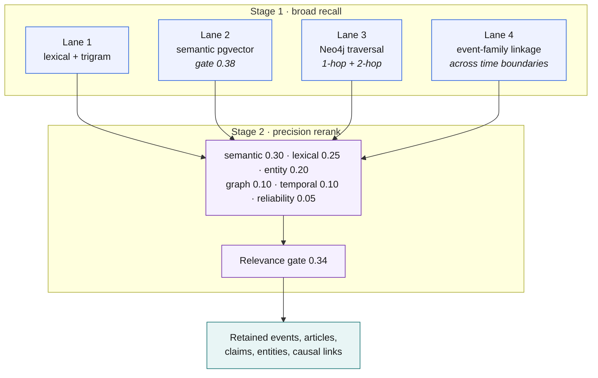
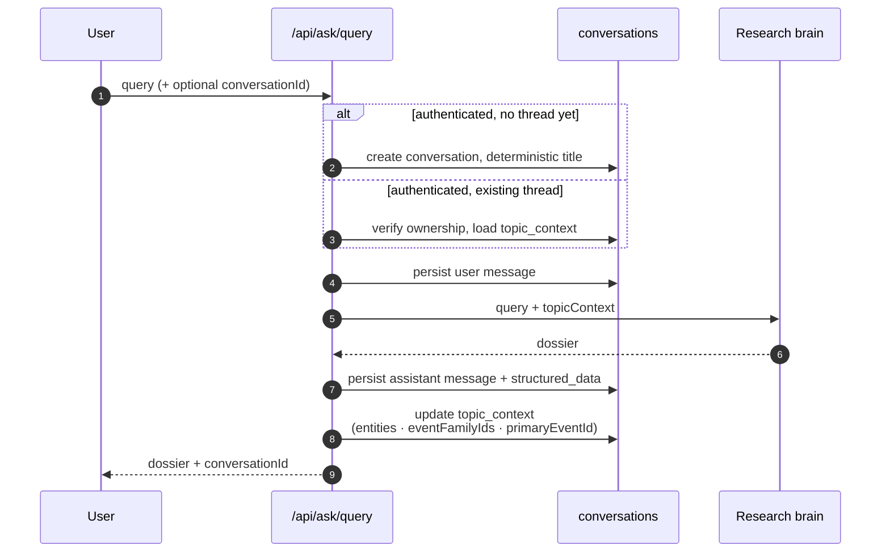
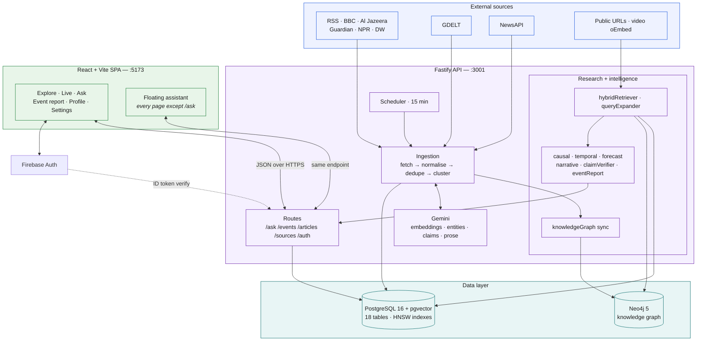
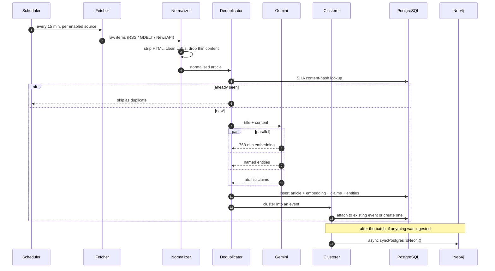
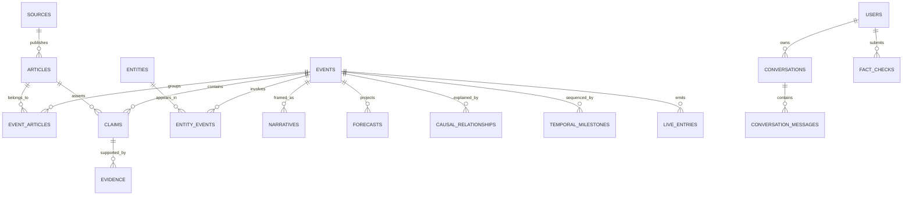

<div align="center">

<br>

# ॥ PRAMĀṆA ॥

**Global news intelligence — verified, contextualised, and traced back to the source.**

<sub>*pramāṇa* (प्रमाण) · Sanskrit · “a valid means of knowledge”</sub>

<br>


<br>

[Overview](#the-problem) · [Capabilities](#capabilities) · [Research brain](#the-research-brain) · [Architecture](#architecture) · [Quick start](#quick-start) · [API](#api-reference) · [Deploy](#deployment) · [Roadmap](#roadmap)

<br>

</div>

---

## The problem

Most people now get their news from a feed — and a feed is optimised for engagement, not accuracy. Two people can read about the same protest and walk away with opposite versions of reality, because the algorithm served each of them the framing they already agreed with.

**PRAMĀṆA takes the opposite approach.** It ingests the same story from many outlets at once, breaks it down into individual claims, and shows what is actually verified, what is still uncertain, where outlets contradict each other — and who framed it which way.

> Not “here are ten links.” Instead: **here is the event, here is what holds up, and here is where the reporting diverges.**

---

## Capabilities

| Capability | What it does | |
|---|---|---|
| **Multi-source ingestion** | RSS · GDELT · NewsAPI, fetched on a rolling schedule |  |
| **Normalise & dedupe** | HTML stripping, tracking-param cleanup, content-hash dedupe |  |
| **Event clustering** | Articles from different outlets collapse into one event |  |
| **Claim & entity extraction** | Atomic claims and named entities pulled from article text |  |
| **Knowledge graph** | Postgres → Neo4j sync after every ingest; graph traversal on every query |  |
| **Two-stage retrieval** | Broad multi-lane recall, then weighted reranking behind a relevance gate |  |
| **Temporal intent routing** | Query classified before retrieval; recency weighting adapts to intent |  |
| **Ask workspace** | Multi-turn research threads with a saved conversation sidebar |  |
| **Floating assistant** | Same pipeline, one keystroke away from any page |  |
| **Fact check mode** | Claim-by-claim verdicts with syndication-aware independence checks |  |
| **Long-form event reports** | Auto-assembled dossier: articles, claims, entities, framing, related events |  |
| **Causal & temporal engines** | Eight-stage cause→effect chains and milestone sequencing |  |
| **Calibrated forecasting** | Logistic-regression escalation model with Wilson intervals |  |
| **Narrative analysis** | Deterministic cross-source framing and terminology comparison |  |
| **URL & video reader** | SSRF-guarded page fetch; oEmbed metadata only for video |  |
| **Image & media verification** | Provenance and reverse lookup for submitted images |  |

<sub>Verdicts are never binary. Every claim resolves to **verified** · **unverified** · **contradicted by [source]** — nothing is labelled “false” without an attributed contradiction.</sub>

---

## The research brain

`POST /api/ask/query` runs a fixed nine-stage pipeline. The governing design choice: **the model writes prose, nothing else.** Every number, verdict, ranking and causal edge is computed before synthesis — and if Gemini is unavailable or times out, stage 8 assembles the same answer deterministically.

```mermaid
flowchart LR
    Q["Query · claim · URL"] --> I["Intent classification<br/><i>current · recent · causal<br/>historical · general</i>"]
    I --> R["1 · Two-stage retrieval<br/><i>4 recall lanes → weighted rerank</i>"]
    R --> P["Hypothesis pruning<br/><i>no corroboration → discarded</i>"]
    P --> C["2 · Causal + temporal chain"]
    C --> N["3 · Narrative framing"]
    N --> F["4 · Calibrated forecast"]
    F --> V["5 · Claim verification<br/><i>+ syndication independence</i>"]
    V --> S["6–8 · Synthesis<br/><i>deterministic fallback</i>"]
    S --> ST["9 · Current status object"]
    ST --> A["Sourced dossier"]

    classDef blue fill:#EEF2FF,stroke:#1A56DB,color:#1A1A1A
    classDef violet fill:#F5F0FF,stroke:#6B21A8,color:#1A1A1A
    classDef green fill:#E8F5E9,stroke:#1A7D37,color:#1A1A1A
    classDef teal fill:#E8F5F5,stroke:#0E6E6E,color:#1A1A1A
    class Q,I blue
    class R,P,C,N,F violet
    class V,S green
    class ST,A teal
```



### Retrieval — two stages, four lanes

The old flat similarity search is gone. Stage 1 casts wide across four independent lanes; stage 2 reranks the union and drops anything under the gate, so an off-topic-but-fluent match cannot survive into the answer.



Thresholds and weights are exported constants (`VECTOR_RECALL_THRESHOLD`, `FINAL_RELEVANCE_THRESHOLD`, `DEFAULT_RETRIEVAL_WEIGHTS`) — tuned against the golden benchmark set, not buried in a function body.

<details>
<summary><b>Temporal intent — five routes, one classifier</b></summary>

<br>

Before anything is fetched, the query is classified into `CURRENT_STATUS` · `RECENT_EVENT` · `CAUSAL` · `HISTORICAL` · `GENERAL_TOPIC`. The intent then reshapes the temporal scoring curve: “is Nepal flooding right now?” weights the last 72 hours heavily, while “history of the Hong Kong handover” removes the recency penalty entirely.

That classification also drives `evidenceState` in the response — `CORROBORATED`, `CURRENT_ACTIVITY_NOT_FOUND`, or `NO_RELEVANT_EVIDENCE_FOUND`. Asking about a live emergency that isn't happening returns a clear negative, not the nearest loosely-related story.

</details>

<details>
<summary><b>Source hierarchy — not all corroboration is equal</b></summary>

<br>

Every source is classified before it counts as evidence:

| Tier | Matches | Weight |
|---|---|---|
| `PRIMARY SOURCE` | `.gov` · `.mil` · `.int` · ministries · press releases · treaties | Highest |
| `SCIENTIFIC_TECHNICAL` | `.edu` · journals · USGS · NASA · Copernicus · met offices | High |
| `INDEPENDENT_NEWS` | Reuters · AP · BBC · Al Jazeera · Guardian · DW · NPR | Standard |
| `SECONDARY_REPORT` | Aggregators and downstream reprints | Low |
| `PUBLIC_SIGNAL` | Social platforms, forums, unattributed posts | Signal only |

**Syndication is caught, not counted.** Twelve outlets running the same wire copy is *one* independent source. `claimVerifier` detects wire origin and computes Jaccard overlap, collapsing reprints into a single independent-source credit before any verdict is issued.

</details>

<details>
<summary><b>Forecasting — <code>pramana-calibrated-logreg-v1.2</code></b></summary>

<br>

**Target:** probability of escalation to critical severity within 72 hours.

The LLM never produces a probability. A logistic regression does, over six features — article velocity, source breadth, source reliability, contradiction penalty, category hazard rate, entity salience — with per-feature contributions exposed so any number traces back to its inputs. Output carries 95% Wilson confidence intervals.

When the evidence base is too thin, the engine returns `NO_FORECAST_JUSTIFIED` instead of a low-confidence guess. A refused forecast is a feature.

</details>

<details>
<summary><b>Causal chains — supported vs inferred</b></summary>

<br>

Eight relationship types: `precondition` · `trigger` · `mechanism` · `chain_reaction` · `amplifier` · `immediate_consequence` · `secondary_effect` · `human_response`.

Each edge stores `is_directly_supported`, a confidence score, and `evidence_refs` pointing at the articles that justify it. Where a stage has no evidence, the report says so rather than bridging the gap with plausible-sounding text.

</details>

---

## Conversation memory

Signed-in queries persist automatically. The first message of a thread creates a conversation with a deterministically generated title — boilerplate question phrasing (“what happened with…”, “can you explain…”) is stripped without an extra LLM round trip.



`topic_context` is what makes follow-ups work: a short pronoun-heavy question (“why did that happen?”) is blended with the thread's last topic before retrieval runs. Ownership is checked on every read, write and delete — a conversation ID belonging to another user returns `404`, never a leak.

**Floating assistant.** `FloatingIntelligence` mounts globally and hides itself on `/ask`. It calls the identical `/ask/query` endpoint, closes on `Escape`, and hands the thread off to the full workspace via `/ask?cid=…`. A dedicated parity test asserts the two surfaces return structurally identical output — no second, weaker code path.

---

## Architecture

A React SPA talks to a Fastify API, which owns two databases: PostgreSQL for records and vectors, Neo4j for relationships.



<details>
<summary><b>How one article becomes intelligence</b></summary>

<br>



**Fail-open by design:** without `GEMINI_API_KEY` the pipeline still fetches, normalises, dedupes and clusters — it skips enrichment rather than collapsing. Calls are spaced 250 ms apart to stay inside free-tier quota.

</details>

---

## Data model

PostgreSQL — 18 tables across four migrations, `pgvector` HNSW indexes on `articles.embedding` and `events.embedding`, `pg_trgm` GIN indexes for fuzzy title search.



| Migration | Adds |
|---|---|
| `001_core_schema` | 14 core tables, pgvector + pg_trgm, HNSW indexes |
| `002_user_profile_settings` | JSONB `users.settings` + GIN index |
| `003_causal_temporal_intelligence` | `causal_relationships`, `temporal_milestones`, article `wire_service` + `syndication_cluster_id` |
| `004_conversations` | `conversations`, `conversation_messages`, JSONB `topic_context` |

<details>
<summary><b>Neo4j graph schema</b></summary>

<br>

Eleven uniqueness constraints and nine text indexes, created idempotently on migrate:

`Person` · `Organization` · `Country` · `Location` · `Event` · `Article` · `Claim` · `Source` · `Topic` · `Narrative` · `Policy`

`knowledgeGraph.js` mirrors Postgres into the graph after each ingest batch. `queryGraphContext()` traverses 1-hop and 2-hop neighbours and now returns `discoveredArticleIds` and `discoveredEventIds` — graph hits feed straight back into the retrieval rerank rather than sitting in a sidebar.

</details>

---

## Stack

| Layer | Choice | Why |
|---|---|---|
| Frontend | React 18 · Vite 6 · React Router 6 · Zustand | Fast HMR, tiny state layer, no framework lock-in |
| Styling | Hand-written CSS design system (~3,100 lines) | Editorial look, light mode only, zero UI-kit weight |
| Backend | Node ≥20 · Fastify 5 | Schema-first, fast, first-party helmet/cors/rate-limit |
| Relational | PostgreSQL 16 + pgvector + pg_trgm | Records, vectors and fuzzy search in one engine |
| Graph | Neo4j 5 Community (+ APOC) | Entity, causal and narrative relationships |
| AI | Gemini flash-lite · `gemini-embedding-001` @ 768-dim | Free-tier friendly; prose only, never arithmetic |
| Auth | Firebase Auth (Google) + `firebase-admin` | Server-side token verification, no password storage |
| Jobs | Interval scheduler + DB job table + `pg-boss` | Locked runs, retry tracking, no extra infrastructure |
| Tests | Vitest — 91 tests, 17 suites | Real HTTP calls against a built app instance |
| Infra | Docker Compose · npm workspaces · Render + Vercel | One command locally, two services in production |

---

## Quick start

**Prerequisites** · `Node.js ≥ 20` · `Docker + Docker Compose` · `Git`

**1 — Clone and install**

```bash
git clone https://github.com/xeevees-lab/pramana.git
cd pramana
npm install
```

**2 — Configure environment**

```bash
cp .env.example .env
```

Then open `.env` and fill in the values listed below.

**3 — Start the databases**

```bash
docker compose up -d && docker compose ps
```

PostgreSQL 16 + pgvector on **`5433`** (deliberately off 5432 to avoid clashing with a local Postgres); Neo4j 5 on **`7474`** (browser) and **`7687`** (Bolt).

**4 — Migrate and seed**

```bash
npm run db:migrate
```

Applies all four migrations, pgvector HNSW indexes, Neo4j constraints, and seeds seven default global sources.

**5 — Run it**

```bash
npm run dev
```

| URL | What |
|---|---|
| `localhost:5173` | The app — lands on Explore |
| `localhost:5173/ask` | Research workspace · Fact Check toggles inside it |
| `localhost:3001/api/health` | Liveness |
| `localhost:3001/api/health/ready` | Readiness — per-dependency status |

No Firebase keys yet? Use **Explore Intelligence Platform (Guest Access)** on the login screen. Guests get the full research pipeline; only conversation history requires an account.

---

## Environment variables

| Variable | | Where to get it |
|---|:--:|---|
| `DATABASE_URL` / `PG*` | default | Pre-filled to match `docker-compose.yml` |
| `NEO4J_URI` · `NEO4J_USER` · `NEO4J_PASSWORD` | default | Pre-filled to match `docker-compose.yml` |
| `FIREBASE_PROJECT_ID` | required | Firebase Console → Project Settings |
| `FIREBASE_CLIENT_EMAIL` · `FIREBASE_PRIVATE_KEY` | required | Firebase Console → Service Accounts → Generate key |
| `VITE_FIREBASE_*` | required | Firebase Console → Project Settings → Web app config |
| `GEMINI_API_KEY` | required | [Google AI Studio](https://aistudio.google.com/apikey) |
| `SESSION_SECRET` | required | Any random 64-char string |
| `GEMINI_MODEL` | optional | Generation model override · default `gemini-3.5-flash-lite` |
| `GEMINI_EMBEDDING_MODEL` | optional | Embedding override · default `gemini-embedding-001` |
| `NEWSAPI_KEY` | optional | [newsapi.org](https://newsapi.org) — RSS + GDELT work without it |
| `CORS_ORIGIN` | optional | Extra allowed origin for a custom production domain |
| `INGESTION_INTERVAL_MINUTES` | optional | Default `15` |
| `RATE_LIMIT_MAX` · `RATE_LIMIT_WINDOW_MS` | optional | Default `100` · `60000` |

> `.env` is gitignored. The `VITE_*` values ship to the browser by design — they are public Firebase identifiers, not secrets. Everything else stays server-side.

---

## API reference

Base URL: `http://localhost:3001/api`

<details open>
<summary><b>Research</b> — <code>optionalAuth</code>, works signed-in or as guest</summary>

<br>

| Method | Endpoint | Body | Description |
|:--:|---|---|---|
| `POST` | `/ask/query` | `{ query, mode, conversationHistory, conversationId, url }` | Full dossier — executive summary, current status, claims, sources, graph context, causal chain, timeline, forecast |
| `POST` | `/ask/fact-check` | `{ query, url }` | Verification mode — claim-by-claim verdicts with independence checks |
| `POST` | `/fact-check` | `{ content, url }` | Compatibility alias for legacy callers |

`mode` accepts `ask` · `fact_check` · `research`. Pass `url` to pull in a public page (SSRF-validated) or a video URL — video returns oEmbed metadata only, never a fabricated transcript. When authenticated, the response carries `conversationId`.

</details>

<details>
<summary><b>Conversations</b> — <code>requireAuth</code>, strict per-user ownership</summary>

<br>

| Method | Endpoint | Description |
|:--:|---|---|
| `GET` | `/ask/conversations` | 60 most recently updated threads |
| `GET` | `/ask/conversations/:id` | Thread + ordered messages with `structured_data` |
| `POST` | `/ask/conversations` | Create a thread explicitly |
| `DELETE` | `/ask/conversations/:id` | Delete a thread and cascade its messages |

</details>

<details>
<summary><b>Public</b></summary>

<br>

| Method | Endpoint | Description |
|:--:|---|---|
| `GET` | `/health` · `/health/ready` | Liveness · per-dependency readiness |
| `GET` | `/events` | Paginated events · `?category= &severity= &status= &q= &page= &limit=` |
| `GET` | `/events/live` | Latest live-wire entries · `?limit=` (max 50) |
| `GET` | `/events/:id` | Dossier + assembled long-form `report` + `relatedEvents` |
| `GET` | `/articles` · `/articles/:id` | Paginated articles · `?source_id= &event_id= &q=` |
| `GET` | `/sources` | Configured ingestion sources |

</details>

<details>
<summary><b>Account</b> — <code>Authorization: Bearer &lt;firebase-id-token&gt;</code></summary>

<br>

| Method | Endpoint | Description |
|:--:|---|---|
| `POST` | `/auth/session` | Verify token, create or refresh the DB user |
| `GET` | `/auth/me` · `/auth/stats` | Current user record · real activity stats |
| `PATCH` | `/auth/profile` | Update display name and bio (validated) |
| `GET` `PUT` | `/auth/settings` | Read / write user preferences |
| `DELETE` | `/auth/account` | Permanent account deletion |
| `POST` `PATCH` `DELETE` | `/sources` · `/sources/:id` | Manage sources |
| `POST` | `/sources/:id/fetch` · `/sources/fetch-all` | Trigger ingestion on demand |

</details>

---

## Project structure

```
pramana/
├── client/
│   ├── src/
│   │   ├── pages/                   Explore · Live · Ask · Event · Profile · Settings
│   │   ├── components/
│   │   │   ├── layout/Header.jsx
│   │   │   └── common/FloatingIntelligence.jsx
│   │   ├── stores/                  Zustand auth store
│   │   ├── services/                api.js · firebase.js
│   │   └── styles/                  index · ask-workspace · event-report
│   │                                explore-hub · floating-intelligence
│   └── vercel.json                  SPA rewrite
├── server/
│   ├── src/
│   │   ├── routes/                  health · auth · sources · articles · events · ask
│   │   ├── services/
│   │   │   ├── gemini.js
│   │   │   ├── ingestion/           fetchers · normalizer · deduplicator
│   │   │   │                        clusterer · pipeline · scheduler
│   │   │   ├── research/            askEngine · hybridRetriever · queryExpander
│   │   │   │                        urlReader · videoReader
│   │   │   └── intelligence/        causalEngine · temporalEngine · forecastEngine
│   │   │                            narrativeAnalyzer · claimVerifier
│   │   │                            knowledgeGraph · eventReport
│   │   ├── db/                      pool · neo4j · 4 migrations · seeds
│   │   ├── middleware/auth.js       requireAuth · optionalAuth
│   │   └── app.js  server.js
│   └── tests/                       17 Vitest suites
├── docker-compose.yml               Postgres + pgvector · Neo4j + APOC
├── render.yaml                      API service definition
└── package.json                     npm workspaces root
```

---

## Testing

```bash
npm test
```

91 tests across 17 Vitest suites, run against a real built Fastify instance.

| Suite | Covers |
|---|---|
| `retrieval_golden_set` | 10 benchmark categories — intent accuracy, recall, distractor suppression |
| `assistant_parity` | Floating assistant and `/ask` return structurally identical output |
| `conversations` | Title generation, auth rejection, cross-user ownership isolation |
| `e2e_research_brain` | Full query → dossier pipeline |
| `ask_fact_check` | Ask + fact-check endpoints, SSRF guards, video URL detection |
| `hybrid_retrieval` · `query_expansion` | Lane scoring, reranking, hypothesis pruning |
| `claim_verification` | Source hierarchy, wire detection, independence clustering |
| `causal_temporal` · `ml_forecasting` · `narrative_analysis` | Intelligence engines |
| `knowledge_graph` · `events_report` | Neo4j traversal, long-form report assembly |
| `ingestion` · `auth` · `profile_settings` · `health` | Foundation |

The golden set is a benchmark, not a lookup table — the queries and target tokens live in the test file and are deliberately absent from production code, so a passing score reflects retrieval quality rather than memorised routes.

```bash
npm run test:e2e
```

Playwright, against a running app. *(The `e2e/` specs are still not in the tree — the browser-level suite remains the outstanding testing task.)*

---

## Deployment

| Piece | Host | Config |
|---|---|---|
| API | Render (free plan) | `render.yaml` — migrations run on boot via `start` |
| Client | Vercel | `client/vercel.json` — SPA rewrite to `index.html` |
| Postgres | Any managed pgvector host | Supabase · Neon · Render auto-detected |
| Neo4j | Aura or self-hosted | `NEO4J_URI` over `neo4j+s://` |

SSL turns on automatically when `NODE_ENV=production` or the connection string points at Supabase, Neon or Render. CORS accepts `*.vercel.app`, `*.onrender.com`, any `localhost` port, and whatever is set in `CORS_ORIGIN`.

---

## Design system

Light mode only. Editorial typography — `Source Serif 4` for reading, `Inter` for UI, `JetBrains Mono` for data. Colour carries epistemic status, never decoration.

| | Token | Meaning |
|:--:|---|---|
|   | `--color-verified` | Corroborated by independent sources |
|   | `--color-unverified` | Reported, not yet corroborated |
|   | `--color-contradicted` | Directly contradicted by an attributed source |
|   | `--color-forecast` | Projection — explicitly *not* fact |
|   | `--color-narrative` | Framing / narrative signal |
|   | `--color-accent` | Interaction and navigation |

---

## Roadmap

```mermaid
gantt
    title Build phases
    dateFormat X
    axisFormat %s
    section Shipped
    Foundation and schema            :done, p1, 0, 1
    Ingestion pipeline               :done, p2, 1, 2
    Events, dossiers and live wire   :done, p3, 2, 3
    Auth, profile and settings       :done, p4, 3, 4
    Retrieval and Ask workspace      :done, p5, 4, 5
    Fact check and verification      :done, p6, 5, 6
    Explore hub and event reports    :done, p7, 6, 7
    Causal, temporal and forecast    :done, p8, 7, 8
    Two-stage retrieval and memory   :done, p9, 8, 9
    section Next
    Image and media verification     :active, p10, 9, 10
    Forecast calibration tracking    :p11, 10, 11
    E2E suite and Android client     :p12, 11, 12
```



- [x] **1–4** · Workspaces, Docker, schema, ingestion pipeline, events, auth
- [x] **5** · Hybrid retrieval, query expansion, hypothesis pruning, Ask workspace
- [x] **6** · Deterministic claim verification, syndication independence, fact-check mode
- [x] **7** · Explore hub as home surface, long-form event reports, related events
- [x] **8** · Causal + temporal engines, calibrated forecasting, narrative analysis, KG sync
- [x] **9** · Two-stage multi-lane retrieval, intent routing, conversation memory, floating assistant, golden benchmark suite
- [ ] **10** · Image and media verification — provenance, reverse lookup
- [ ] **11** · Forecast resolution tracking and drift-aware recalibration
- [ ] **12** · Playwright E2E suite, production hardening, Android client

<sub>Housekeeping: <code>DashboardPage.jsx</code> and <code>FactCheckPage.jsx</code> are no longer routed — <code>/</code> redirects to <code>/explore</code>, <code>/fact-check</code> to <code>/ask?mode=fact-check</code>. Both files can be deleted.</sub>

---

## Principles

> **Fact first, context second, narrative third, forecast fourth.**
> Layers are never blended. A projection is never rendered as a finding.
>
> **Nothing without provenance.**
> Every claim carries its origin tier — primary, scientific, independent, secondary, or public signal.
>
> **Never call it false.**
> Only *unverified*, or *contradicted by a named source*.
>
> **The model writes prose, not numbers.**
> Probabilities, rankings, verdicts and causal edges are computed in code. Hypotheses without corroboration are discarded, never promoted to fact.
>
> **An honest negative beats a fluent guess.**
> `NO_FORECAST_JUSTIFIED`, `CURRENT_ACTIVITY_NOT_FOUND` and the relevance gate all exist to return nothing rather than something plausible.

<div align="center">
<br>
<sub><b>PRAMĀṆA uses AI and can make mistakes. Verify important claims against the linked primary sources.</b></sub>
<br><br>
</div>

---

## Contributing

Issues and PRs welcome. Run `npm test` and `npm run lint` before opening one, and keep the no-mock-data rule intact — a feature ships when it works end to end, not when it looks like it does.

## License

[MIT](LICENSE) © 2026 Veenus Patil

<div align="center">
<br>

Built by [@xeevees-lab](https://github.com/xeevees-lab)

<sub>प्रमाण — that by which knowledge is validly obtained.</sub>

<br>
</div>
