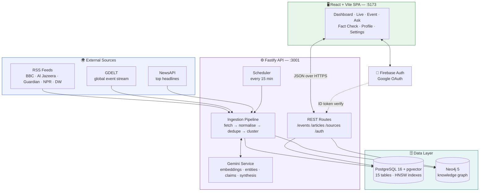
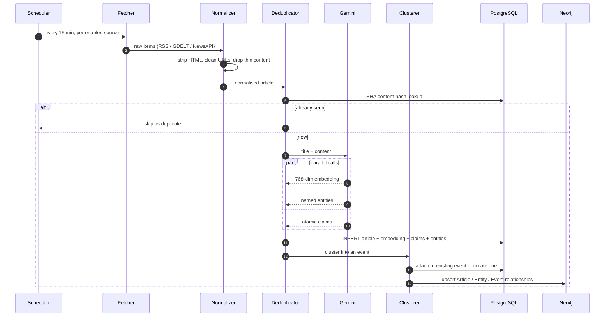
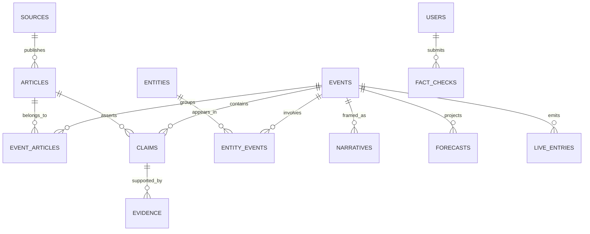

<div align="center">

# ॥ PRAMĀṆA ॥

### **Global news intelligence — verified, contextualised, and traced back to the source.**

*Pramāṇa (प्रमाण) — Sanskrit: "a valid means of knowledge."*

<br>

[](https://nodejs.org)
[](https://react.dev)
[](https://vitejs.dev)
[](https://fastify.dev)

[](https://github.com/pgvector/pgvector)
[](https://neo4j.com)
[](https://ai.google.dev)
[](https://firebase.google.com)


<br>

**[Overview](#-the-problem) · [Features](#-features) · [Architecture](#%EF%B8%8F-architecture) · [Quick Start](#-quick-start) · [API](#-api-reference) · [Roadmap](#%EF%B8%8F-roadmap)**

</div>

---

## 🧭 The problem

Most people now get their news from a feed — and a feed is optimised for engagement, not accuracy. Two people can read about the same protest and walk away with opposite versions of reality, because the algorithm served each of them the framing they already agreed with.

**PRAMĀṆA takes the opposite approach.** It ingests the same story from many outlets at once, breaks it down into individual **claims**, and shows you what is actually verified, what is still uncertain, what outlets contradict each other on — and *who framed it which way*.

> Not "here are 10 links." Instead: **here is the event, here is what holds up, and here is where reporting diverges.**

---

## ✨ Features

| | Capability | What it does | Status |
|:--:|---|---|:--:|
| 📡 | **Multi-source ingestion** | RSS + GDELT + NewsAPI fetched on a rolling schedule | ✅ Built |
| 🧹 | **Normalise & dedupe** | HTML stripping, tracking-param cleanup, content-hash dedupe | ✅ Built |
| 🧲 | **Event clustering** | Related articles from different outlets collapse into one event | ✅ Built |
| 🏷️ | **Category & severity inference** | 11 categories — conflict, diplomacy, markets, climate, health… | ✅ Built |
| 🧠 | **Claim & entity extraction** | Gemini pulls atomic claims and named entities out of article text | ✅ Built |
| 📰 | **Event dossiers** | One page per event: articles, claims, entities, narratives, forecasts | ✅ Built |
| 🔴 | **Live wire** | Rolling feed of newly detected events and updates | ✅ Built |
| 🔐 | **Auth + profile** | Firebase Google sign-in, profile, settings, account deletion, guest mode | ✅ Built |
| 🕸️ | **Knowledge graph** | Neo4j nodes & constraints for people, orgs, places, claims, policies | 🟡 Schema live |
| 🔎 | **Ask (RAG retrieval)** | Ask a question, get a sourced answer from the archive | 🚧 Phase 5 |
| ✅ | **Fact Check** | Paste a post/URL → claim-by-claim verdict with evidence | 🚧 Phase 6 |
| 🧭 | **Explore** | Browse by topic, region and entity across the graph | 🚧 Phase 7 |
| 📈 | **Forecast layer** | Scenario projections, explicitly separated from fact | 🚧 Planned |

<sub>Verdicts are never binary. Every claim resolves to **verified** · **unverified** · **contradicted by [source]** — a claim is never labelled "false" without an attributed contradiction.</sub>

---

## 🏗️ Architecture

A React SPA talks to a Fastify API, which owns two databases: **PostgreSQL** for records + vectors, **Neo4j** for relationships.



<details>
<summary><b>🔬 How one article becomes intelligence (click to expand)</b></summary>

<br>



**Fail-open by design:** if `GEMINI_API_KEY` is absent or quota-limited, the pipeline still fetches, normalises, dedupes and clusters — it simply skips the enrichment step instead of collapsing.

</details>

---

## 🗃️ Data model

**PostgreSQL** — 15 tables, `pgvector` HNSW indexes on `articles.embedding` and `events.embedding`, `pg_trgm` GIN indexes for fuzzy title search.



<details>
<summary><b>🕸️ Neo4j graph schema</b></summary>

<br>

Eleven uniqueness constraints and nine text indexes, created idempotently on migrate:

`Person` · `Organization` · `Country` · `Location` · `Event` · `Article` · `Claim` · `Source` · `Topic` · `Narrative` · `Policy`

The graph is what makes "how did the framing of this change over five years" answerable without re-scanning the whole corpus — relationships are traversed, not recomputed.

</details>

---

## 🧰 Tech stack

| Layer | Choice | Why |
|---|---|---|
| **Frontend** | React 18 · Vite 6 · React Router 6 · Zustand | Fast HMR, tiny state layer, no framework lock-in |
| **Styling** | Hand-written CSS design system (822 lines of tokens) | Editorial look, light mode only, zero UI-kit weight |
| **Backend** | Node ≥20 · Fastify 5 | Schema-first, fast, first-party helmet/cors/rate-limit |
| **Relational** | PostgreSQL 16 + pgvector + pg_trgm | Records, vectors and fuzzy search in one engine |
| **Graph** | Neo4j 5 Community (+ APOC) | Entity and narrative relationships |
| **AI** | Gemini 2.5 Flash · `text-embedding-004` | Free-tier friendly, fast enough for ingest-time work |
| **Auth** | Firebase Auth (Google) + `firebase-admin` | Token verification server-side, no password storage |
| **Jobs** | Interval scheduler + DB job table + `pg-boss` | Locked runs, retry tracking, no extra infrastructure |
| **Tests** | Vitest (unit + integration) · Playwright (E2E) | Real HTTP calls against a built app instance |
| **Infra** | Docker Compose · npm workspaces | One command to stand up both databases |

---

## 🚀 Quick start

### Prerequisites

`Node.js ≥ 20` · `Docker + Docker Compose` · `Git`

### 1 — Clone and install

```bash
git clone https://github.com/xeevees-lab/pramana.git
cd pramana
npm install
```

### 2 — Configure environment

```bash
cp .env.example .env
```

Then open `.env` and fill in the values below.

### 3 — Start the databases

```bash
docker compose up -d && docker compose ps
```

Brings up PostgreSQL 16 + pgvector on **`5433`** (deliberately off 5432 to avoid clashing with a local Postgres) and Neo4j 5 on **`7474`** (browser) / **`7687`** (Bolt).

### 4 — Migrate and seed

```bash
npm run db:migrate
```

Applies the 15-table schema, pgvector HNSW indexes, Neo4j constraints, and seeds seven default global sources.

### 5 — Run it

```bash
npm run dev
```

| URL | What |
|---|---|
| http://localhost:5173 | The app |
| http://localhost:3001/api/health | Liveness |
| http://localhost:3001/api/health/ready | Readiness — per-dependency status |

No Firebase keys yet? Click **“Explore Intelligence Platform (Guest Access) →”** on the login screen and browse everything read-only.

---

## 🔑 Environment variables

| Variable | Required | Where to get it |
|---|:--:|---|
| `DATABASE_URL` / `PG*` | ⚙️ default | Pre-filled to match `docker-compose.yml` |
| `NEO4J_URI` / `NEO4J_USER` / `NEO4J_PASSWORD` | ⚙️ default | Pre-filled to match `docker-compose.yml` |
| `FIREBASE_PROJECT_ID` | ✅ | Firebase Console → Project Settings |
| `FIREBASE_CLIENT_EMAIL` · `FIREBASE_PRIVATE_KEY` | ✅ | Firebase Console → Service Accounts → Generate key |
| `VITE_FIREBASE_*` | ✅ | Firebase Console → Project Settings → Web app config |
| `GEMINI_API_KEY` | ✅ | [Google AI Studio](https://aistudio.google.com/apikey) |
| `NEWSAPI_KEY` | ➖ | [newsapi.org](https://newsapi.org) — RSS + GDELT work without it |
| `SESSION_SECRET` | ✅ | Any random 64-char string |
| `INGESTION_INTERVAL_MINUTES` | ➖ | Defaults to `15` |
| `RATE_LIMIT_MAX` / `RATE_LIMIT_WINDOW_MS` | ➖ | Defaults to `100` / `60000` |

> ⚠️ `.env` is gitignored. The `VITE_*` values ship to the browser by design — they are public Firebase identifiers, not secrets. Everything else stays server-side.

---

## 📡 API reference

Base URL: `http://localhost:3001/api`

<details open>
<summary><b>Public</b></summary>

| Method | Endpoint | Description |
|:--:|---|---|
| `GET` | `/health` | Liveness — status, timestamp, version |
| `GET` | `/health/ready` | Readiness — Postgres, Neo4j, Firebase, Gemini |
| `GET` | `/events` | Paginated events · `?category= &severity= &status= &q= &page= &limit=` |
| `GET` | `/events/live` | Latest live-wire entries · `?limit=` (max 50) |
| `GET` | `/events/:id` | Full dossier — articles, claims, entities, narratives, forecasts |
| `GET` | `/articles` | Paginated articles · `?source_id= &event_id= &q=` |
| `GET` | `/articles/:id` | Single article |
| `GET` | `/sources` | Configured ingestion sources |

</details>

<details>
<summary><b>Authenticated — <code>Authorization: Bearer &lt;firebase-id-token&gt;</code></b></summary>

| Method | Endpoint | Description |
|:--:|---|---|
| `POST` | `/auth/session` | Verify token, create/refresh the DB user |
| `GET` | `/auth/me` | Current user record |
| `PATCH` | `/auth/profile` | Update display name and bio (validated) |
| `GET` `PUT` | `/auth/settings` | Read / write user preferences |
| `GET` | `/auth/stats` | Real account activity stats |
| `DELETE` | `/auth/account` | Permanent account deletion |
| `POST` | `/sources` · `PATCH` `/sources/:id` · `DELETE` `/sources/:id` | Manage sources |
| `POST` | `/sources/:id/fetch` · `/sources/fetch-all` | Trigger ingestion on demand |

</details>

---

## 📁 Project structure

```
pramana/
├── client/                        # React + Vite SPA
│   └── src/
│       ├── pages/                 # Dashboard · Live · Event · Ask · FactCheck · Profile · Settings
│       ├── components/layout/     # Header / nav
│       ├── stores/                # Zustand auth store
│       ├── services/              # api.js · firebase.js
│       └── styles/                # Design-system CSS
├── server/                        # Fastify API
│   ├── src/
│   │   ├── routes/                # health · auth · sources · articles · events
│   │   ├── services/
│   │   │   ├── gemini.js          # embeddings · entities · claims · synthesis
│   │   │   └── ingestion/
│   │   │       ├── fetchers/      # rss.js · gdelt.js · newsapi.js
│   │   │       ├── normalizer.js  deduplicator.js
│   │   │       ├── clusterer.js   pipeline.js  scheduler.js
│   │   ├── db/                    # pool · neo4j · migrations · seeds
│   │   ├── middleware/auth.js     # Firebase token verification
│   │   └── app.js  server.js
│   └── tests/                     # Vitest suites
├── docker-compose.yml             # Postgres + pgvector, Neo4j + APOC
├── .env.example
└── package.json                   # npm workspaces root
```

---

## 🧪 Testing

```bash
npm test
```

Vitest runs four suites against a real built Fastify instance — auth guards, health probes, ingestion utilities (URL cleaning, HTML stripping, content hashing, category/severity inference), and profile/settings persistence including validation rejects.

```bash
npm run test:e2e
```

Playwright, against a running app. *(The `e2e/` specs are not in the tree yet — this is the next testing task.)*

---

## 🎨 Design system

Light mode only. Editorial typography — `Source Serif 4` for reading, `Inter` for UI, `JetBrains Mono` for data. Colour carries **epistemic status**, never decoration:

| | Token | Meaning |
|:--:|---|---|
|  | `--color-verified` | Corroborated by multiple independent sources |
|  | `--color-unverified` | Reported, not yet corroborated |
|  | `--color-contradicted` | Directly contradicted by an attributed source |
|  | `--color-forecast` | Projection — explicitly *not* fact |
|  | `--color-narrative` | Framing / narrative signal |
|  | `--color-accent` | Interaction and navigation |

---

## 🗺️ Roadmap

```mermaid
gantt
    title PRAMĀṆA build phases
    dateFormat X
    axisFormat %s
    section Shipped
    Foundation & schema        :done, p1, 0, 1
    Ingestion pipeline         :done, p2, 1, 2
    Events, dossiers & live    :done, p3, 2, 3
    Auth, profile & settings   :done, p4, 3, 4
    section In progress
    RAG retrieval (Ask)        :active, p5, 4, 5
    section Next
    Fact Check verification    :p6, 5, 6
    Explore & graph browser    :p7, 6, 7
    Forecast layer + calibration :p8, 7, 8
```



- [x] **Phase 1** — Workspaces, Docker, 15-table schema, pgvector + Neo4j constraints
- [x] **Phase 2** — RSS / GDELT / NewsAPI fetchers, normalise → dedupe → cluster, scheduler
- [x] **Phase 3** — Event dossiers, live wire, dashboard, event pages
- [x] **Phase 4** — Firebase auth, profile, settings, account deletion, guest mode
- [ ] **Phase 5** — Retrieval layer: embed the archive, vector + graph hybrid search, sourced answers
- [ ] **Phase 6** — Fact Check: submit a post or URL, claim-by-claim verdict with evidence
- [ ] **Phase 7** — Explore: topic / region / entity browsing over the graph
- [ ] **Phase 8** — Framing-shift-over-time and calibrated forecasting with drift tracking
- [ ] **Phase 9** — Playwright E2E suite, deployment, Android client

---

## ⚖️ Principles

> **1. Fact first, context second, narrative third, forecast fourth.**
> Layers are never blended. A projection is never rendered as a finding.
>
> **2. Nothing without provenance.**
> Every claim carries its origin — archive, grounded search, primary source, or reporting.
>
> **3. Never call it false.**
> Only *unverified*, or *contradicted by a named source*.
>
> **4. No mock data.**
> If a feature has no real data path yet, the UI says so plainly instead of faking it.

<div align="center">
<br>
<sub><b>PRAMĀṆA uses AI and can make mistakes. Verify important claims against the linked primary sources.</b></sub>
</div>

---

## 🤝 Contributing

Issues and PRs welcome. Please run `npm test` and `npm run lint` before opening a PR, and keep the no-mock-data rule intact — a feature ships when it works end to end, not when it looks like it does.

---

## 📄 License

[MIT](LICENSE) © 2026 Veenus Patil

<div align="center">
<br>

**Built by [@xeevees-lab](https://github.com/xeevees-lab)**

<sub>प्रमाण — that by which knowledge is validly obtained.</sub>

</div>
